# 教室で使えるかもしれないもの作り #◯ 「書いて出して、終わり」にしない。クラス全員で読み合う句会アプリ「GIGA句会プラザ」

## 🏫 はじめに

国語の俳句の授業で、こんなことになっていませんか。短冊は全員ぶん集まったのに、みんなで読み合えたのは、そのうちの数人ぶんだけ。

短冊を配って、五・七・五を書かせて、集めるところまでは進みます。問題はそのあとです。放課後に模造紙へ貼り、次の時間に「では、いくつか読んでみましょう」と言う。けれど時間の都合で読めるのは、せいぜい五人か六人ぶん。残りの子の句は、だれの目にも触れないまま学級通信のすみに小さく載って終わります。

俳句は、詠むことと同じくらい、読み合うことが大事なのだと思います。ところが読み合う時間をとろうとすると、集める、並べる、貼る、写す、という段取りのほうに時間を持っていかれます。作品そのものと向き合う時間が、いちばん先に削られてしまう。

それなら、集めるところと並べるところは画面にまかせてしまえばいい。そう考えて作ったのが「GIGA句会プラザ」です。クラス全員が俳句を詠んで、読み合って、投票して、結果を発表するまでを、一つの画面のなかで済ませられるようにしました。

用意するものは Google アカウントだけです。サーバーの費用も、外部のサービスの契約も要りません。作品の置き場所は、先生ご自身の Google ドライブに自動で作られる表計算ファイルが1つだけです。

置いてあるのはこちらです。

https://github.com/GIGAyama/Haiku-meeting

国語の俳句づくりが本来の使いみちですが、理科の実験のあとや、体育の試合のあとの振り返りを五・七・五で書かせる、という使い方もできます。三行に収めようとすると、子どもたちは自分が何を見て何を感じたのかを、いやでも選ぶことになります。

## 📱 このアプリでできること

画面は5つで、上のタブで切り替えます。子どもたちが使うのが「投稿」「広場」「自分」「過去」の4つ、先生だけが入るのが「先生」の1つです。

最初に開いたときには、短い案内が出ます。これはその端末で一度だけ出るもので、二度目からは出ません。

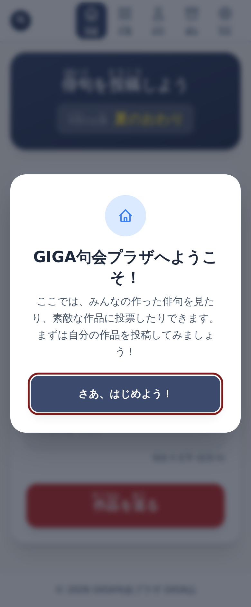

はじめて開いたときの案内。「さあ、はじめよう！」を押すと消えます。

「投稿」の画面では、上に今回のお題が大きく出ます。お題は先生の画面から書き換えられます。

投稿の画面。お題が上にあるので、何を詠むのかを見失いません。

名前と、上の句、中の句、下の句を、それぞれの欄に入れます。それぞれの欄の下には「現在 5 文字 (目安:5)」と出ます。

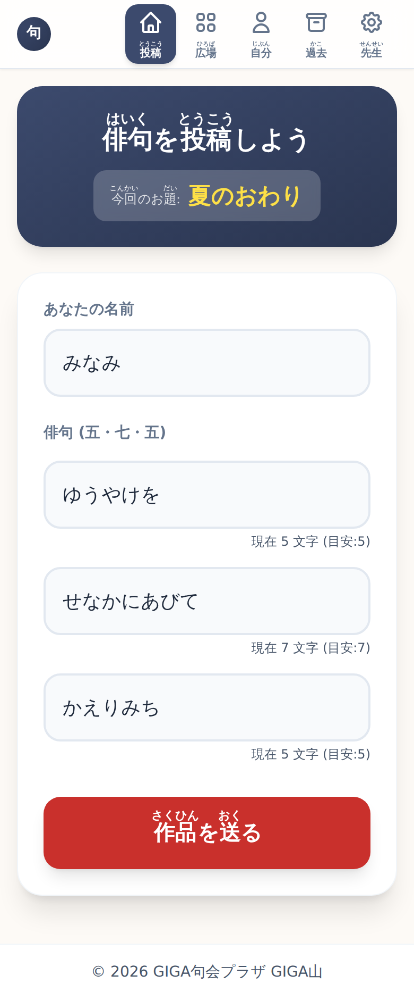

三行を入れたところ。目安との差がその場で分かります。

ここは迷ったところです。五・七・五からはずれたら送れないようにする作りも考えました。けれどそうすると、子どもは指を折って字を数えることに気をとられて、言いたいことを削ってしまいます。字余りにも字足らずにも、そうしたくなった理由があるはずです。だから目安として見せるだけにして、はずれていても送れるようにしました。止めるかどうかは、画面ではなく先生が決めることだと思っています。

画面の広い端末では、右側に縦書きの短冊が出て、入力した文字がその場で映ります。清書する前に、自分の句がどう見えるかを確かめられます。

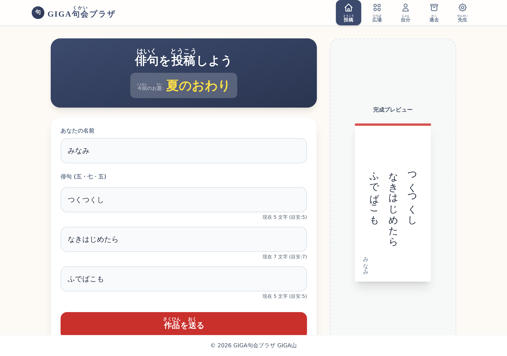

タブレットを横にしたときや、パソコンで開いたときは、右側に完成の姿が出ます。

送ると「広場」に移ります。ここが句会の会場です。みんなの句が縦書きの短冊になって並びます。

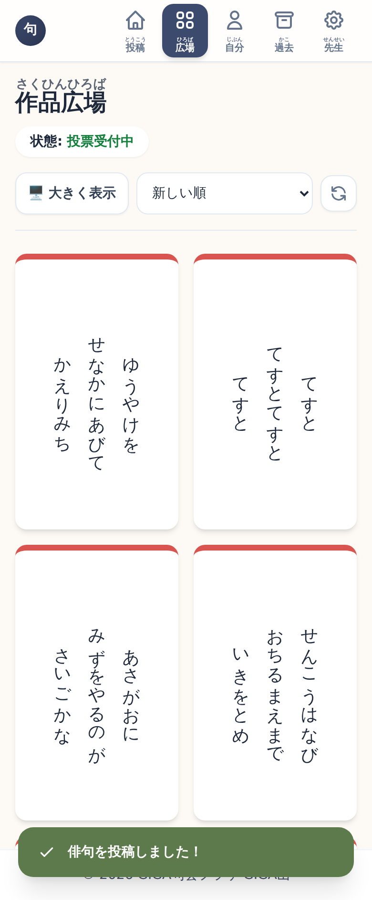

送れたことを知らせる帯が下に出て、そのまま広場に移ります。

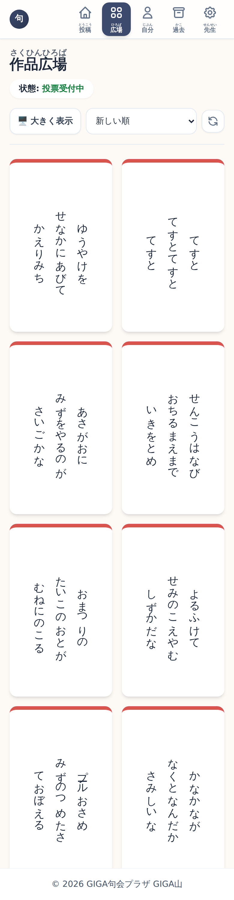

広場。だれの句かは分からないまま、作品だけが並びます。

投票を締め切るまで、作者の名前は出しません。画面に出さないだけでなく、名前そのものを端末に送っていないので、くわしい子が画面の裏側をのぞいても分からないようにしてあります。名前が見えると、子どもは作品ではなく人を選びはじめます。それだけは避けたいと思いました。

短冊をタップすると、その句が大きく開きます。ここで投票とコメントができます。

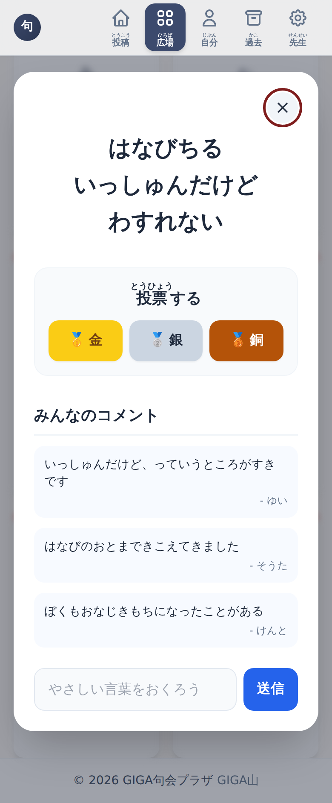

開いた画面。上に句、その下に投票、いちばん下にみんなのコメントが並びます。

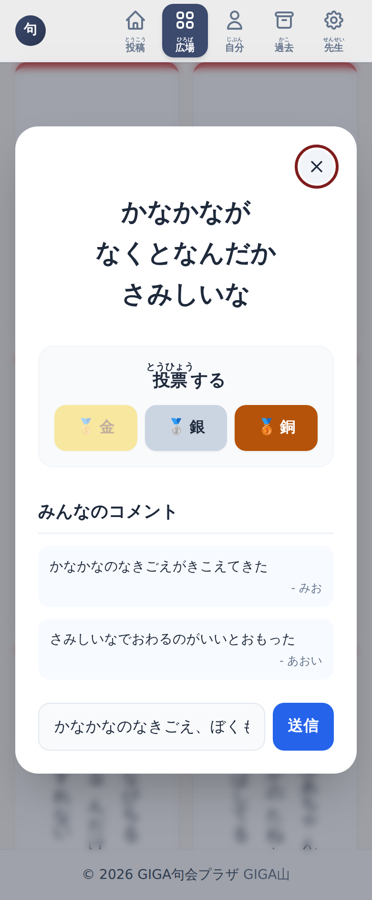

コメントの欄には「やさしい言葉をおくろう」と薄く書いてあります。何を書けばいいか迷う子への合図のつもりです。

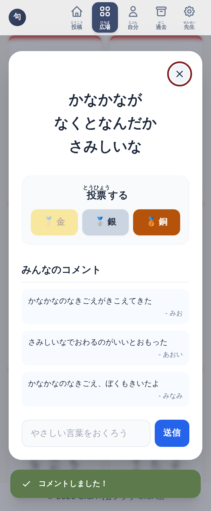

送ったコメントは、すぐ下に並びます。金のボタンが薄くなっているのは、この子がもう金を使ったからです。

「自分」のタブには、自分が詠んだ句と、その句がもらった点数、もらったコメントがまとまって出ます。いまの句会のぶんだけでなく、前の回のぶんも一緒に並びます。

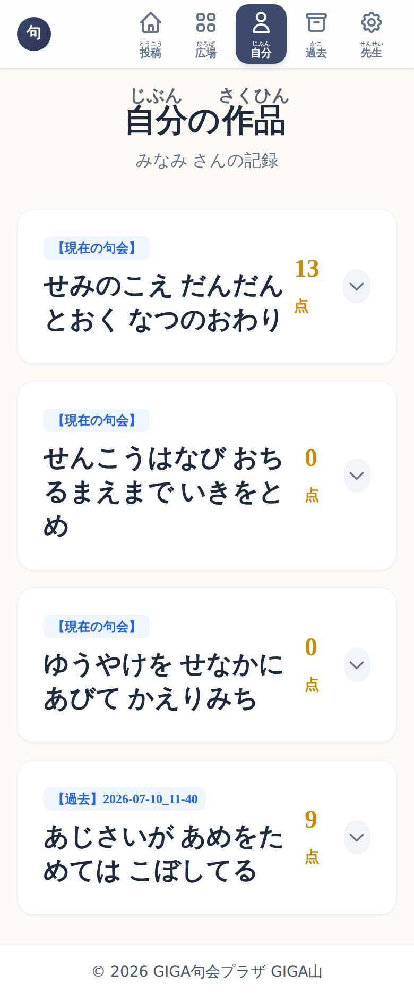

自分の作品。何点だったかが右に出ます。

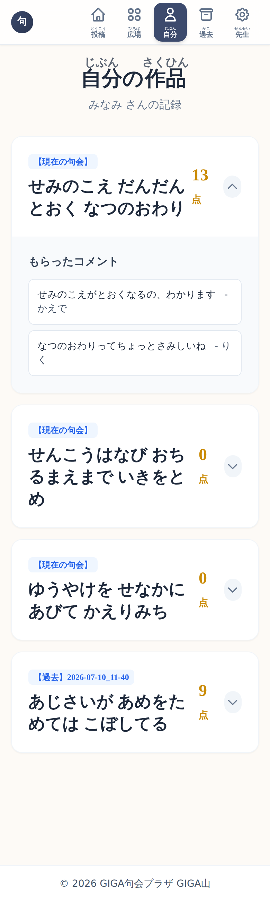

句をタップすると、もらったコメントが開きます。前の回の句も、同じ場所から読み返せます。

「過去」のタブでは、終わった句会を開催日ごとに読み返せます。こちらには作者の名前が付いています。

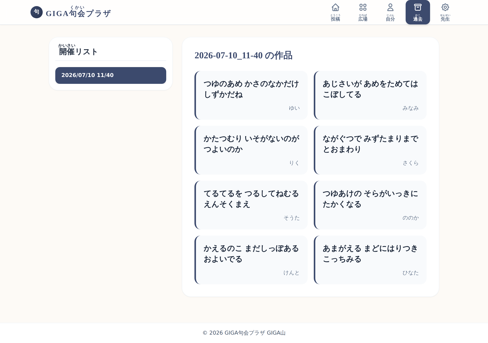

過去の句会。学期の終わりに読み返すと、季節の移りかわりがそのまま並びます。

## 🥇 金・銀・銅の三票しか持たせない

このアプリでいちばん考えたのが、投票のしくみです。

一人が持っている票は、金と銀と銅の三枚だけです。金が3点、銀が2点、銅が1点になります。同じ賞は一度しか使えません。同じ作品に二回は入れられません。押したら取り消せません。

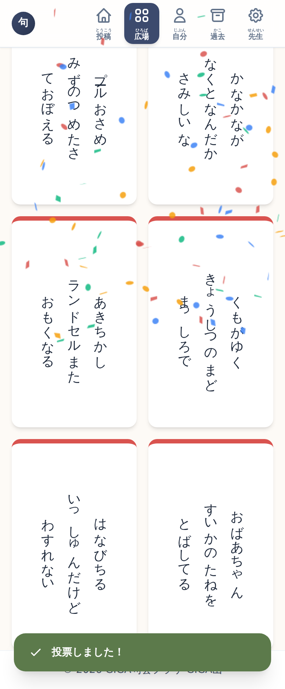

投票すると紙吹雪が舞います。一票の重さを、少しだけ演出でも支えたいと思いました。

「いいと思ったものすべてに丸を付けましょう」という形にすることもできました。そのほうが子どもも気楽です。でもそれだと、たぶん最初の数句を読んで丸を付けて終わりになります。三枚しか持っていないから、どれに使うかを決めるために全部読むことになる。読ませるためのしくみとして、あえて足りない枚数にしてあります。

自分の句には投票の欄が出ません。コメントの欄も出ません。ただし、これは画面の側で欄を出さないようにしているだけです。名前を変えてもう一度出し直せば、技術的には自分の句にも入れられます。

同じ賞を二度使えないことと、同じ句に二度入れられないことは、画面ではなくサーバーの側で確かめています。こちらは画面をいじっても抜けられません。

先生が「投票を締め切る」を押すと、広場は結果発表の画面に変わります。金賞、銀賞、銅賞が出て、ここではじめて作者の名前が明かされます。子どもたちの画面では紙吹雪が舞います。

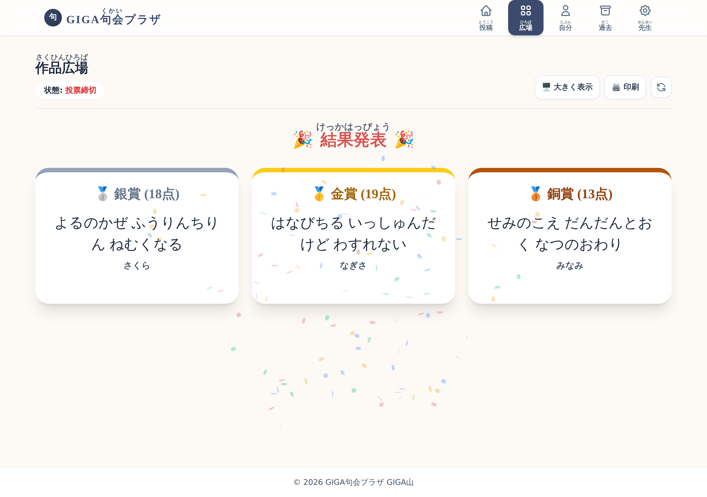

結果発表。得点の高い順に上位三つの点数を、金賞、銀賞、銅賞としています。

同じ点数の作品が複数あれば、その全員が同じ賞になります。無理に一人に絞りません。0点の作品は賞に入りません。締め切ったあとに「投票を受付する」に戻せば、名前はまた伏せられて一覧に戻ります。授業の終わりに押しそこねても取り返しがつきます。

締め切ったあとの広場には「印刷」のボタンが出ます。A4の縦で、上のタブも下の著作権表示も紙には刷りません。紙吹雪も刷りません。

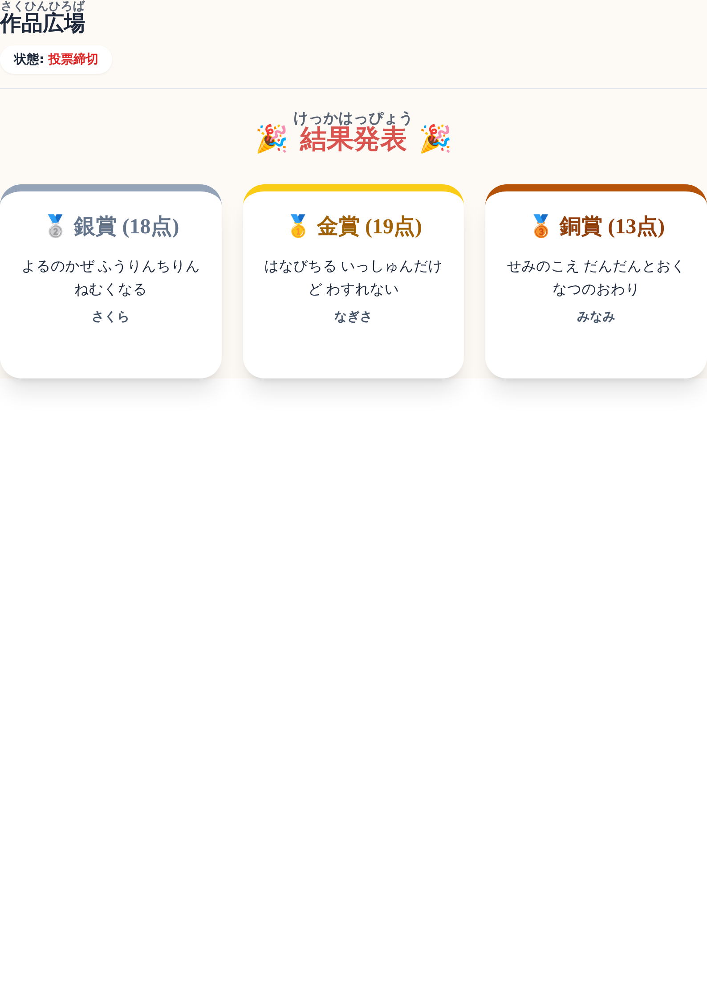

印刷したときに紙へ載るのは、この三枚だけです。学級通信に貼るなら、ここを切り取るのがいちばん早いと思います。

## 🖥 電子黒板に映すときだけ、名前を伏せる

結果発表は、教室のみんなで見たい場面です。そこで広場に「大きく表示」を用意しました。押すと字も余白も1.5倍になり、全画面に切り替わります。

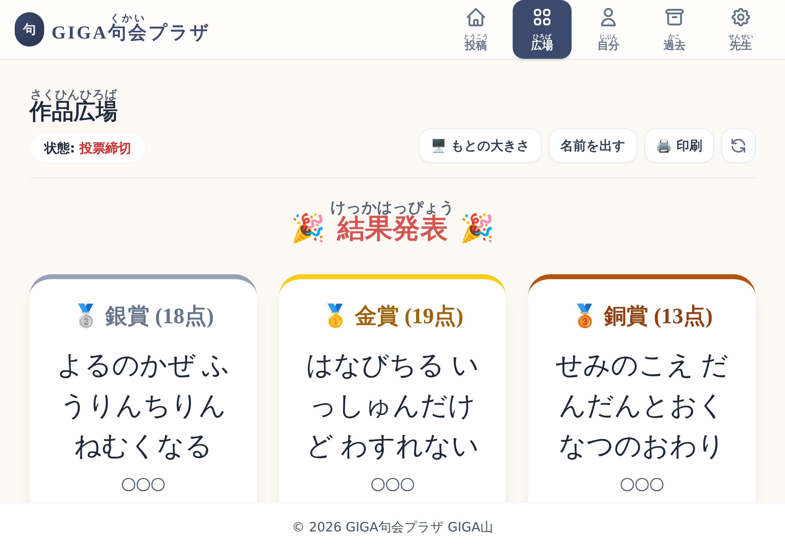

大きく表示したところ。受賞した子の名前は 〇〇〇 と伏せられています。

ここで名前を伏せているのには理由があります。電子黒板は、廊下を通る人からも見えてしまいます。教室のなかで発表するつもりの名前が、通りがかりの人の目に入るのは、たぶん本人が望んでいることではありません。だから大きく映したときだけは、既定で伏せるようにしました。

発表するときは「名前を出す」を押します。

「名前を出す」を押すと、そこではじめて作者が出ます。発表の間をつくる装置にもなります。

大きくしたまま別のタブに移ると、自動でもとの大きさに戻ります。先生が電子黒板で使ったあと、子どもの手元が巨大なまま残らないようにしてあります。

## ✨ 導入のメリット

三つのいいことが期待できます。

一つ目は、全員の作品が必ず読まれることです。紙で集めていたときは、時間の都合で読まれる子と読まれない子が出ていました。画面に並べれば、全員の句が最初から並びます。しかも三票しか持っていないので、子どもたちは端から端まで読むことになります。「わたしの句、だれも読んでいないかもしれない」と思う子がいなくなれば、次に書くときの構えが変わるのではないかと思っています。

二つ目は、集計と掲示から解放されることです。短冊を集めて、並べて、貼って、点数を数えて、という作業がなくなります。締め切りを押した瞬間に結果が出ます。空いた時間は、「この句はどこがいいのだろう」と子どもたちに問い返すことに使えます。効率化そのものが目的ではなくて、削れるところを削って、削れないところに時間を寄せるための道具のつもりです。

三つ目は、書いたものが残っていくことです。一年ぶんの句が、開催日ごとに残ります。子どもは「自分」のタブから、自分がこれまでに詠んだ句と、もらったコメントをいつでも読み返せます。四月に書いた句と十二月に書いた句が並ぶと、成長は数字で示さなくても本人に伝わるのではないかと思います。

## 🛠️ 【管理者向け】導入手順

情報担当の先生に確認されそうなところを、先に書いておきます。

### 準備するもの

Google アカウントが1つあれば足ります。ふだんお使いの学校のアカウントで大丈夫です。

### 貼り付ける手順

1. https://script.new/ を開きます。もとから入っているコードは、すべて消してください。
2. リポジトリにある code.gs の中身を、まるごと貼り付けます。
3. 左の「ファイル」の横にある「＋」から「HTML」を選び、これを4回くり返します。名前はそれぞれ index、app、css、vendor にします。拡張子は自動で付くので入力しません。
4. それぞれに、リポジトリにある index.html、app.html、css.html、vendor.html の中身を貼り付けます。
5. 右上の「デプロイ」から「新しいデプロイ」を選び、種類を「ウェブアプリ」にします。
6. 実行するユーザーを「自分」にします。アクセスできるユーザーは「同一ドメインの全員」をおすすめします。学校の Google アカウントを持つ人だけが開ける状態になります。
7. 表示された URL を子どもたちに配れば準備完了です。

貼り付けるファイルは全部で5つです。index は残りの3つを読み込む造りなので、1つでも欠けると画面が真っ白になります。名前が1文字でも違っても出ません。うまく出ないときは、まずここを疑ってください。

vendor はいちばん長くて157キロバイトほどあります。途中で切れると画面が出ないので、全文を選んで貼り付けてください。

「全員（匿名ユーザーを含む）」を選ぶと、URL を知っていれば校外の人でも投稿と投票とコメントができます。児童が学校のアカウントを持っていない場合はこちらを選ぶことになりますが、そのときは句会をする時間だけ公開して、終わったら公開を止めてください。

最初にだれかが URL を開いた瞬間に、「【自動生成】GIGA句会プラザ_DB」という表計算ファイルが、公開した先生の Google ドライブに自動で作られます。事前に用意したり、番号を設定したりする必要はありません。

### 合言葉を決めてください

先生用の画面に入る合言葉は、はじめは決まっていません。公開したあと、いちばん最初に「先生」タブを開いた人が、その場で決めます（6文字以上）。児童に URL を配る前に、先生が先に開いて決めてください。あとから変えたいときは、管理の画面の下のほうに変更する欄があります。

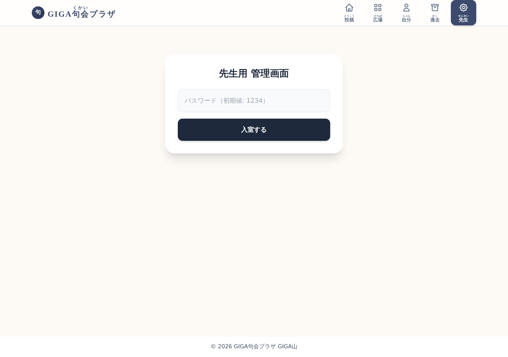

先生のタブは合言葉で守られています。ここに入れないかぎり、お題も締め切りも動かせません。

以前の版では、お題の変更や締め切りやミュートといった操作が、画面のボタンを隠しているだけの状態でした。くわしい子が画面の裏側から直接呼べてしまう作りだったので、いまはログインしたときに受け取った合鍵をサーバー側で照らし合わせてから実行するようにしてあります。合鍵は先生用のタブを離れると消えるので、そのつど入り直しが必要です。手間ですが、ここは手間のほうを選びました。

### 校内のフィルタリングで通すもの

かならず通す必要があるのは、アプリ本体が置かれる script.google.com だけです。

見た目のために2つ使っていますが、どちらも届かなくてもアプリは動きます。和風の書体を読むために fonts.googleapis.com と fonts.gstatic.com を、タブに出る小さな絵のために drive.google.com を使っています。書体が届かなければ、端末に入っている明朝体で表示されるだけです。

画面を作るための部品は、外から読み込んでいません。学校のフィルタリングで配信元が塞がれると画面がまったく出なくなるので、必要なものは全部アプリの中に持たせてあります。最初に読み込む量はあわせて256キロバイトほどです。

### 個人情報について

子どもが入れるのはニックネームで足ります。出席番号でも、ひらがなの名前でも構いません。入れた名前はその端末に覚えられて、次から自動で入ります。

書かれたものはすべて、公開した先生のドライブにある表計算ファイルの中だけにあります。外部のサービスには何も送っていません。表計算ファイルは直接開けるので、誤字を直したり、消したい行を消したりするのは、そこでするのがいちばん確実です。

### 共用端末をお使いの場合

だれが投票したかは、端末に作られた印で見分けています。ですから別の端末や別のブラウザで開き直すと、同じ子がもう一度三票を使えてしまいます。一人一台で、投票の間は端末を替えないようにしてください。共用の端末を交代で使う形の投票には向きません。

### いま無いもの

正直に書いておきます。結果を表計算の形で書き出す機能はありません。自動生成された表計算ファイルをそのままお使いください。広場も先生の画面も自動では更新されないので、最新の状態を見るにはボタンを押します。オフラインでは使えません。

## 📖 【利用者向け】使い方のガイド

### 子どもたちに伝えること

1. 先生から配られた URL を開きます。
2. 最初に出る案内を「さあ、はじめよう！」で閉じます。
3. 「投稿」のタブで、名前と、上の句、中の句、下の句を入れます。
4. 「作品を送る」を押します。送れると自動で「広場」に移ります。
5. 「広場」で、ほかの人の短冊をタップして読みます。
6. いいと思った句に、金、銀、銅のどれかを入れます。三つとも別の句に入れます。
7. 感想があれば、下の欄に書いて送ります。
8. 新しい作品が出ているかを見るときは、右上の丸い矢印を押します。

四つの欄はどれか一つでも空だと送れません。何句でも投稿できます。上限はありません。

キーボードだけでも一通り操作できます。Tab で短冊まで移動して、Enter か Space で開きます。開いた画面は Esc で閉じます。閉じるともとの短冊に戻ります。マウスやタッチが使いにくい子がいる学級でも、置いていかずに済むようにしてあります。

字が小さいと感じたら、指を広げて拡大できます。拡大を禁止する設定は入れていません。

### 先生の当日の進め方

1. 「先生」のタブに入り、合言葉を入れます。
2. お題の欄を書き換えて「お題を更新」を押します。
3. 子どもたちに URL を配って、投稿させます。
4. 様子を見るときは「最新の情報に更新」を押します。参加した人数、投稿の数、票の数、コメントの数が出ます。
5. 読み合いと投票の時間をとります。
6. 「投票を締め切る」を押します。子どもたちの広場が結果発表に変わります。
7. 電子黒板に映すなら、広場の「大きく表示」を押します。発表するときに「名前を出す」を押します。
8. 次の回に進むときは「新しい句会を準備する」を押します。

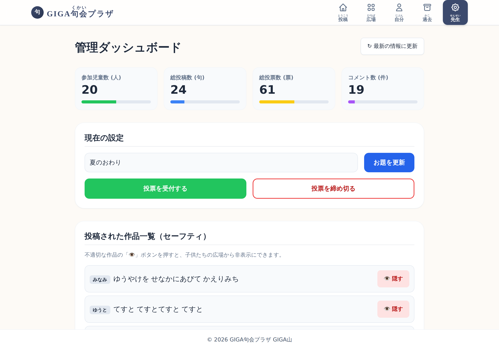

管理の画面。数字はボタンを押したときに読み直します。放っておいても増えません。

数字の下にある横棒は、40人、120句、120票、200件を満たしたときにいっぱいになる目安です。クラスの規模を表すものではないので、半分までしか伸びていなくても気にしなくて大丈夫です。

### 出したくない作品が出てしまったとき

管理の画面の下に、投稿された作品の一覧があります。

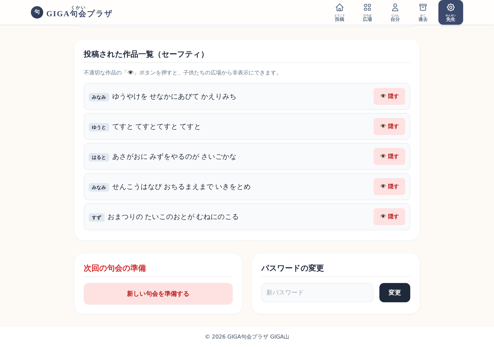

投稿された作品の一覧。作者の名前と句が並びます。

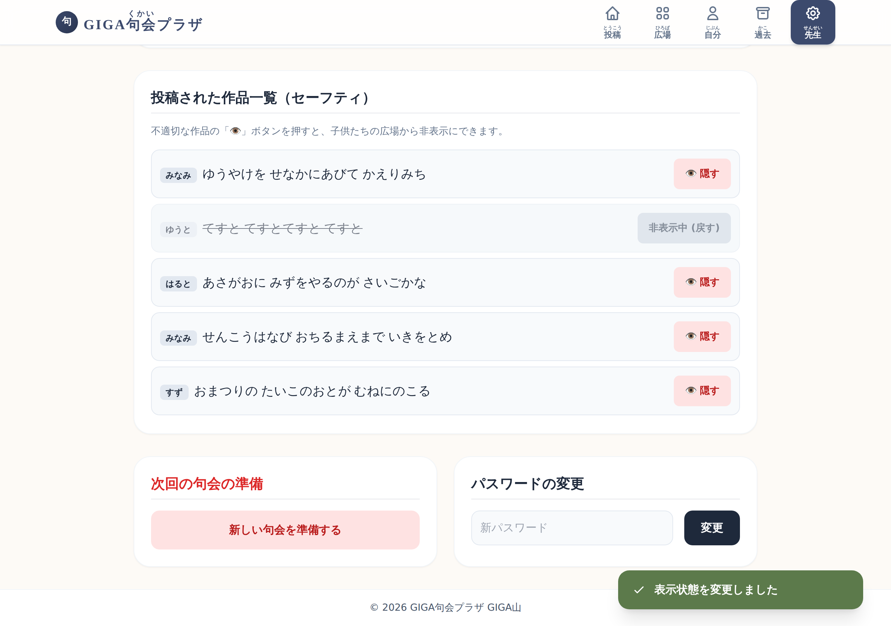

「隠す」を押すと、その作品は子どもたちの広場から消えます。消えたのではなく隠れているだけなので、いつでも戻せます。

送り方を試しただけの投稿や、書きかけのまま送ってしまった句を、その場でどけられます。データは消えていないので、「非表示中 (戻す)」を押せば戻ります。ただし、隠した作品も本人の「自分」のタブには残ります。完全に見えなくしたいときは、表計算ファイルでその行を消してください。

### 締め切りと、次の回の準備

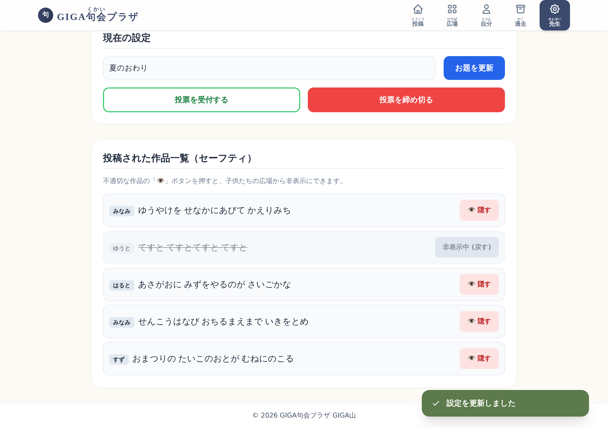

締め切ると、押したボタンのほうが塗りつぶされます。いまどちらの状態かが、ひと目で分かります。

締め切りは何度でも戻せます。「新しい句会を準備する」だけは戻せません。押すと、いまの作品とコメントと票が日時の付いた場所に移り、空の状態から始まります。移したぶんは子どもたちの「過去」のタブから読めます。

一つだけ順番の注意があります。先に投票を締め切ってから、新しい句会を準備してください。締め切らないまま準備すると、その回の作品はすべて作者非公開として保存されて、あとから名前を出せなくなります。

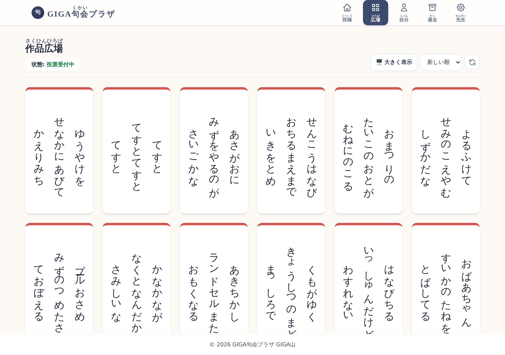

締め切る前の広場。並び替えを「ランダム」にすると、いつも同じ句が先頭に来ることを避けられます。

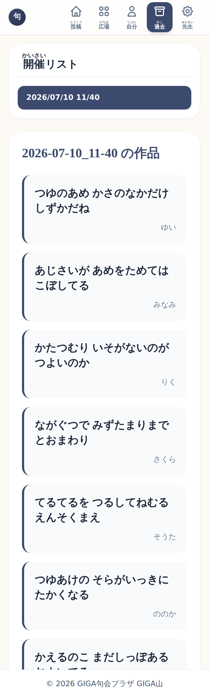

「過去」のタブは、開催日を選ぶとその回の作品が並びます。学期末の振り返りに使えると思います。

## 📝 まとめ

このアプリがしているのは、集めることと並べることだけです。どの句がいいのかを決めるのは子どもたちで、どこがいいのかを言葉にさせるのは先生です。その二つは、機械には代われません。

ただ、集めることと並べることに使っていた時間は、たしかに返ってきます。返ってきた時間を、「どうしてこの句を選んだの」と聞くことに使えたら、それがいちばんの使いみちだと思います。ICT を使う理由は、速く終わらせることそのものではなくて、子どもと向き合う時間をつくるためだと考えています。

はじめての導入は、たしかに気が重いものです。貼り付けるファイルが5つあると聞くだけで、やめておこうかと思われるかもしれません。それでも、一度うまく動けば、次からは URL を配るだけになります。

一歩踏み出そうとする先生を、私はいつでも全力で応援しています。
